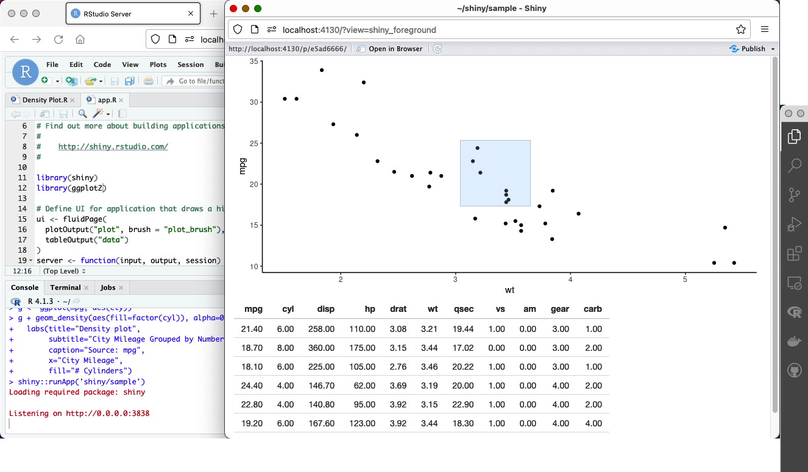
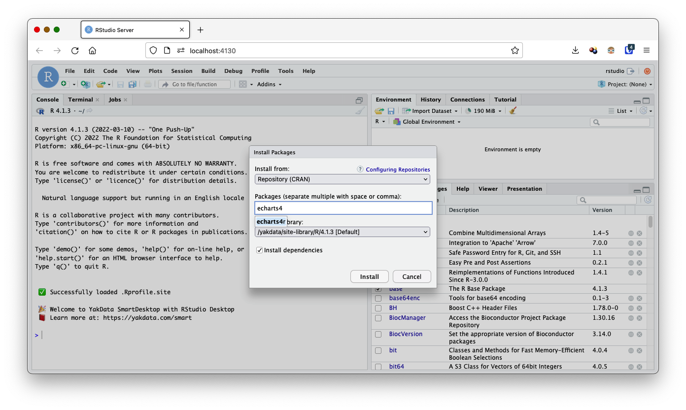

# YakData SmartDesktop with RStudio Desktop

## The Best Way to Download & Install RStudio Desktop on Mac or Windows in 2022

A smart, portable, reproducible way to develop R programs, Shiny web apps & RMarkdown docs on your desktop. Includes R 4.1.2, the RStudio Desktop IDE, the tidyverse, verse and geospatial-related tools from the R rocker-org project as a web app. All wrapped neatly into Docker via docker-compose.

<br/>


<br/><br/>
  - [🚀 Features](#-features)
  - [📷 Screenshots](#-screenshots)
  - [🌵 Directory Structure](#-directory-structure)
  - [🧰 Install and setup](#-install-and-setup)
  - [🔒 Running this securely on a remote system](#-running-this-securely-on-a-remote-system)
  - [🔐 LICENSE](#-license)
  - [⭐ Inspiration](#-inspiration)
  - [📫 Issues](#-issues)
  - [📘 Docs](#-docs)
  - [🎡 Alternatives](#-alternatives)
  - [🧑‍💻 Discussion](#-discussion)
  - [🎉 About YakData](#-about-yakdata)

## 🚀 Features

* YakData SmartDesktop with RStudio Desktop Server Open Source is the smart way to develop R programs, Shiny web apps & RMarkdown docs on your desktop. It includes R 4.1.2 from the Rocker project, the RStudio IDE as a web app all wrapped neatly into Docker.
* Save hours of time to get up and running with a complete desktop IDE for R. 
* Preloaded with the tidyverse, verse and geospatial-related tools from the R rocker-org project! Includes tex & publishing-related packages from verse.
* Designed to install packages from RStudio Package Manager on a fixed date. Easily change this in Rprofile.site. Rapid installation of most packages as this image is based on Ubuntu.
* Easy access to all the RStudio configuration and startup values.
* The end of complex uninstall/upgrade paths for R and RStudio on your laptop/desktop system. 
* Easily recreate an identical environment on another system.
* Run multiple versions of R side-by-side with multiple SmartDesktop project directories.
* Define various environments for a particular R version with multiple docker-compose files.
* Control resources used by your R sessions with docker-compose. No more system lock because an R session unexpectedly stole all your desktop resources.
* Pause and restart a long-running R session with Docker Desktop!

## 📷 Screenshots

- ggplot2 graph

<br/><br/>
- Shiny app graph brushing

<br/><br/>
- Install package to site-library<br/>

<br/><br/>

## 🌵 Directory Structure

```
├── LICENSE
├── README.md
└── yakdata
    ├── apps
    │   └── docker-compose.yml
    ├── config
    │   ├── R
    │   │   └── Rprofile.site
    │   └── rstudio
    │       ├── database.conf
    │       ├── file-locks
    │       ├── fonts
    │       │   └── README.md
    │       ├── logging.conf
    │       ├── rserver.conf
    │       ├── rsession.conf
    │       └── themes
    │           └── README.md
    ├── content
    │   ├── R
    │   │   ├── about.txt
    │   │   └── sample
    │   │       └── Density Plot.R
    │   ├── about.txt
    │   ├── data
    │   │   └── about.txt
    │   ├── projects
    │   │   └── about.txt
    │   └── shiny
    │       ├── about.txt
    │       └── sample
    │           └── app.R
    ├── screenshots
    │   ├── 01_ggplot2.png
    │   ├── 02_shiny_app_brushing.png
    │   └── 03_install_package_to_site-library.png
    └── site-library
        └── R
            └── 4.1.2
                └── about.txt

18 directories, 22 files
```
<br/><br/>
## 🧰 Install and setup

We recommend a desktop with a minimum of 1 CPU, 4 GB of RAM and at least 20 GB of free disk storage.  Your project needs may vary widely based on your apps, usage patterns and data volumes. This repository is strictly intended for local, desktop usage. The running container is not secured with encryption.

1. Install Docker and docker-compose on your system.<br/>
   a. Install Docker Desktop on Windows at https://docs.docker.com/desktop/windows/install/, or<br/>
   b. Install Docker Desktop on Mac at https://docs.docker.com/desktop/mac/install/

2. Download [the 4.1.2 version of this repository](https://github.com/Stephen-McDaniel/YakData-SmartDesktop-RStudio/archive/refs/tags/4.1.2.zip
   ). 

3. Unzip the downloaded ZIP file. 

      Move the <b>SmartDesktop-RStudio-4.1.2</b> directory from the unzip operation to the desired location on your computer. <br/>

      For example, on my Mac, I moved it to /Users/stephen/Documents/Development. <br/>

      So, if I navigate to /Users/stephen/Documents/Development I can list the contents and see directory <b>SmartDesktop-RStudio-4.1.2</b> is now located here.

4. Open the terminal on your computer and change directories to the location of the <b>docker-compose.yml</b> file, in my case:
 
   ```cd /Users/stephen/Documents/Development/SmartDesktop-RStudio-4.1.2/yakdata/apps```

   VERIFY that docker-compose.yml is in the current directory. For example:
   
   ```ls -al``` 

5. With the docker-compose up command, Docker will download the needed images (one time only) and start RStudio Desktop (Server edition). 

   ```docker-compose up -d```<br/>

   This will take a while, depending on your internet speed and your computer speed. <br/>
   After runing this the first time, it will typically take 5-20 seconds to start.

6. Check that it is running. 

   ```docker ps``` 

   View the logs. 

   ```docker logs CONTAINERID # use the Container ID that appears from running docker ps```

7. Navigate to your new RStudio IDE from your favorite browser. 

   ```http://localhost:4120/```

8. Enjoy a portable, reproducible R experience!

9. If you need to stop the Docker container, just head back to the .../yakdata/apps location on your system and issue a down command:

   ```docker-compose down```

10. BONUS! 
   For current docker resource usage on your system, try:

    ```docker stats```

Internal to Ubuntu, RStudio maps all content to **/home/rstudio**, which appears in this project tree as **/yakdata/content**.

When installing new packages from the RStudio *Packages* tab -> *Install* button, be certain to change the dropdown to the project tree location, **/yakdata/site-library/R/4.1.2**. If you don't use the docker mounted volume path, your installed libraries will disappear once you stop and restart the docker container.

If you benefit from this project, please click the Star button on this repository and let your colleagues know about it.

## 🔒 Running this securely on a remote system

If you would like to run this on a remote server, I strongly recommend locking down all ports on your server except a port for a VPN server and a port for SSH terminal connection. Then, install a VPN server on your remote system to secure your connection from your desktop, a leading one on Github is https://hub.docker.com/r/kylemanna/openvpn  

If you use a remote server approach, we also recommend adding a password to RStudio. Change the environment section in docker-compose to replace the current setting with 
```      - PASSWORD=MyPasswordHere``` 
If you add a password, CHANGE the one on the above line. The user name for logging into the IDE is "rstudio".

An alternative remote server approach is to use the [YakData SmartManager for ShinyProxy](https://github.com/Stephen-McDaniel/SmartManager-for-ShinyProxy), which includes RStudio Server Open Source along with many other valuable systems for development and secure sharing of Shiny apps, RMarkdown documents and more.

## 🔐 LICENSE

Distributed under the Apache 2.0 license at https://apache.org/licenses/LICENSE-2.0.

RStudio is a registered trademark of RStudio, PBC. YakData is a service mark of YakData, LLC. [RStudio](https://github.com/rstudio/rstudio) products, other content from the [Rocker](https://github.com/rocker-org/rocker-versioned2) project and from CRAN are subject to other licenses which you are bound to by using these components/systems.

## ⭐ Inspiration

* RStudio Open Source Server IDE is a free, open-source IDE for R, Shiny apps and RMarkdown content.
* The RStudio Open Source Server IDE is backed by years of development, feedback and releases.
* Make it easy to create a reproducible, self-contained R development environment on any system.

If you benefit from this project, please give it a ⭐.

## 📫 Issues

Please share issues in this repository [Issues](https://github.com/Stephen-McDaniel/YakData-SmartDesktop-RStudio/issues).

## 📘 Docs

RStudio IDE repository: https://github.com/rstudio/rstudio

RStudio Package Manager: https://packagemanager.rstudio.com/client/#/

Docker Desktop: https://docs.docker.com/desktop/


## 🎡 Alternatives

Alternatives include self-install of the R, the RStudio IDE, tidyverse, verse and more directly on your OS. 

## 🧑‍💻 Discussion

Head over to [The YakData Community](https://meta.yakdata.com). You can login to comment with your Github account, a Google account or your email and a password.

## 🎉 About YakData

[YakData](https://yakdata.com/) is an agile forecasting firm delivering critical-path forecasts for new products, product acquisition, ad growth and sales force expansion to scale and grow your business. 

We build strategic forecasts for your business based on modern, advanced analytic languages and modular data stacks that are quick to develop and share with key stakeholders in your business.

[Successful projects](https://yakdata.com/success) have included forecasting new customer revenue by marketing channel at a leading subscription business, planning a 9-figure acquisition and investment decision at a leading biotech company, optimizing online ad-spend at a leading billion-dollar retailer, building mix-model multi-channel marketing forecasts at a multi-billion dollar video platform and estimating customer lifetime value in real-time at a leading online streaming business.

When you [hire YakData](https://yakdata.com/pricing/), our principals perform the majority of your high-value project work. Our primary mission is to be your trusted confidante as you make critical business investments and decisions. We deliver results that are presentation-ready for executive teams, boards of directors and key investors.

